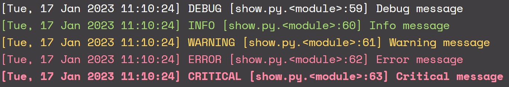
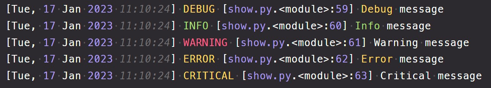

# cologs

[](https://github.com/nullscry/cologs/actions/workflows/ci.yml)
[](https://pypi.python.org/pypi/cologs)

A simple colorful wrapper around `logger` from Python Standard Library with no dependencies. cologs sends its colorful output both to the terminal and into logs/cologs.log. The cologs.log file is rotated inside the logs folder when it gets large enough.

## Installation

```sh
pip install cologs
```

## Usage

```python
from cologs import get_cologs

cologs = get_cologs()
cologs.debug("Debug message")
cologs.info("Info message")
cologs.warning("Warning message")
cologs.error("Error message")
cologs.critical("Critical message")
```

## STDOUT



## Log File


